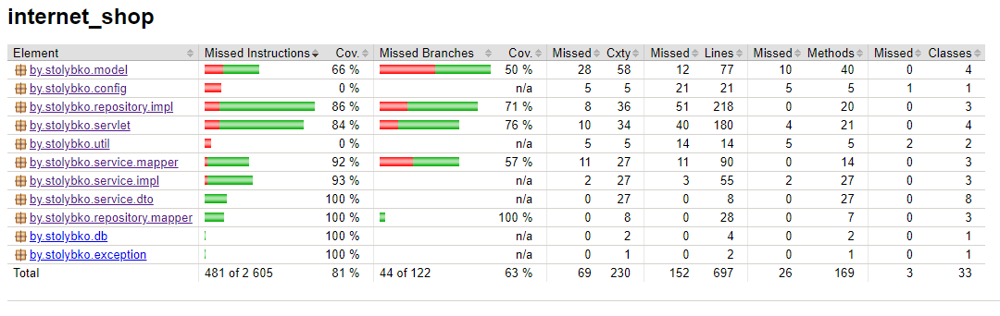
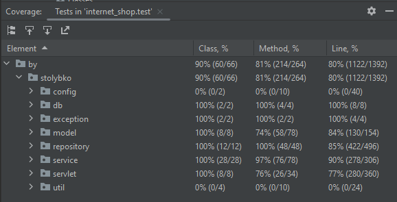
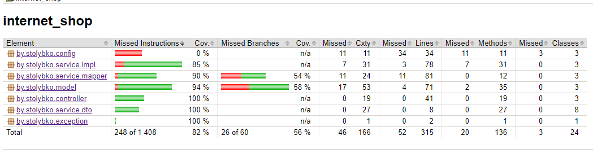
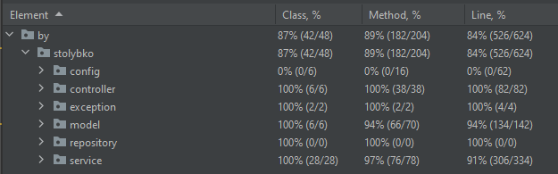

# Задание:

1) Сделать REST сервис с использованием JDBC и Servlet
2) Функционал любой на выбор, минимум CRUD сервис с несколькими видами entity
3) Запрещено использовать Spring, Hibernate, Lombok
4) Можно использовать Hikari CP, Mapstruckt
5) Параметры подключения к БД должны быть вынесены в файл
6) Должны быть реализованы связи ManyToOne(OneToMany), ManyToMany https://en.wikibooks.org/wiki/Java_Persistence/ManyToOne, https://en.wikipedia.org/wiki/Many-to-many_(data_model), https://en.wikipedia.org/wiki/One-to-many_(data_model)
7) Связи должны быть отражены в коде(должны быть соответствующие коллекции внутри энтити)
8) Сервлет должен возвращать DTO, не возвращаем Entity, принимать также DTO
9) Должна быть правильная архитектура https://habr.com/ru/articles/269589/
10) Должен быть сервисный слой
11) Должны соблюдаться принципы ООП, Solid
12) Должны быть unit тесты, использовать Mockito и Junit, для проверки работы репозитория(DAO) с БД использовать testcontainers: https://testcontainers.com/, https://habr.com/ru/articles/444982/
13) Покрытие тестами должно быть больше 80%
14) Должны быть протестированы все слои приложения
15) Слой сервлетов, сервисный слой тестировать с помощью Mockito
16) БД на выбор Postgres, MySQL

Инструкция по запуску
---
Создать базу данных, откорректировать resources/application.yml, заполнить бд используя файл resources/db-migration.sql.
Собрать проект в .war файл и запустить используя сервер Tomcat (либо настроить Tomcat в IntelliJ IDEA)

Endpoints
---
Customers:
~~~
вывод всех клиентов:
GET http://localhost:8080/customers

вывод клиента по id:
GET http://localhost:8080/customers?id=cd0ebac6-2b2d-465c-ab6f-752dcd8cc7ac

создание клиента:
POST http://localhost:8080/customers
{
        "fullName": "Ivanov Ivan Jovanovich2",
        "email": "google1@goo.com"
}

обновление клиента:
PUT http://localhost:8080/customers?id=cd0ebac6-2b2d-465c-ab6f-752dcd8cc7ac
{
        "fullName": "Ivanov Ivan Jovanovich3",
        "email": "test2@test.com"
}

удаление клиента
DELETE http://localhost:8080/customers?id=cd0ebac6-2b2d-465c-ab6f-752dcd8cc7ac
~~~
Products:
~~~
вывод всех продуктов:
GET http://localhost:8080/products

вывод продукта по id:
GET http://localhost:8080/products?id=432c2ccf-91ba-436b-beea-694fd8ac12d9

создание продукта:
{
    "name": "Stol",
    "price": 99.99
}

обновление продукта:
PUT http://localhost:8080/products?id=432c2ccf-91ba-436b-beea-694fd8ac12d9
{
    "name": "Stol2",
    "price": 199.99
}

удаление продукта
DELETE http://localhost:8080/products?id=432c2ccf-91ba-436b-beea-694fd8ac12d9
~~~
Orders:
~~~
вывод всех заказов:
GET http://localhost:8080/orders

вывод заказа по id:
GET http://localhost:8080/orders?id=392a0725-13ca-4f5c-9320-de315386d43e
{
    "id": "392a0725-13ca-4f5c-9320-de315386d43e",
    "customerId": "cd0ebac6-2b2d-465c-ab6f-752dcd8cc7ac",
    "createDate": "02-02-2024 21:32:01",
    "products": [
        {
            "id": "432c2ccf-91ba-436b-beea-694fd8ac12d9",
            "name": "Book",
            "price": 33.25
        },
        {
            "id": "8bcbdbb4-4608-4953-a087-4882c3ac673c",
            "name": "TV",
            "price": 9999.99
        },
        {
            "id": "fea299c4-f9f8-4fb4-8f36-038b651af810",
            "name": "Laptop",
            "price": 500.00
        }
    ]
}

вывод всех заказов по id клиента:
GET http://localhost:8080/orders/customer?id=cd0ebac6-2b2d-465c-ab6f-752dcd8cc7ac

создание заказа:
POST http://localhost:8080/orders
{
    "customerId": "cd0ebac6-2b2d-465c-ab6f-752dcd8cc7ac",
    "products": [
        {
            "id": "432c2ccf-91ba-436b-beea-694fd8ac12d9"

        },
        {
            "id": "8bcbdbb4-4608-4953-a087-4882c3ac673c"
        },
        {
            "id": "fea299c4-f9f8-4fb4-8f36-038b651af811"
        }
    ]
}

обновление заказа:
PUT http://localhost:8080/orders?id=392a0725-13ca-4f5c-9320-de315386d43e
{
    "customerId": "cd0ebac6-2b2d-465c-ab6f-752dcd8cc7ac",
    "products": [
        {
            "id": "432c2ccf-91ba-436b-beea-694fd8ac12d9"

        },
        {
            "id": "8bcbdbb4-4608-4953-a087-4882c3ac673c"
        }
    ]
}

удаление заказа
DELETE http://localhost:8080/orders?id=392a0725-13ca-4f5c-9320-de315386d43e
~~~

Отчёт о покрытии тестами
---

# Update

1) Переписать второе задание на Spring
2) Запрещено использовать Boot, Lombok
3) Сервис должен возвращать DTO
4) Для маппинга из Entity в DTO и наоборот использовать mapstruckt

Отчёт о покрытии тестами
---

